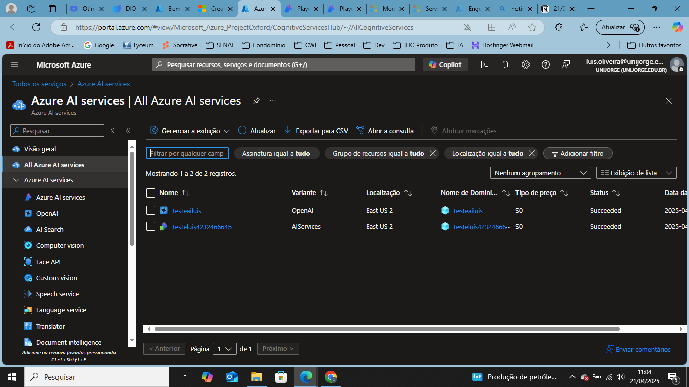
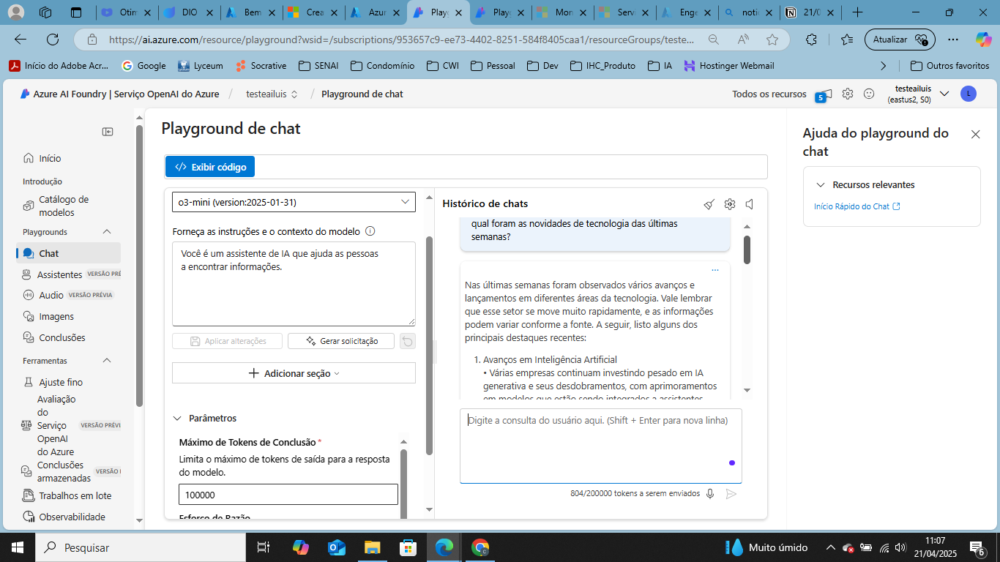

# BootcampAzureOpenAI
# Repositório criado para realizar a entrega do projeto do Bootcampo da DIO sobre Azure OpenAI.
# Autor: Luis Alberto Pires de Oliveira
# Email: oliv.luis@gmail.com
# gitHub: oliv.luis@hotmail.com
# Data: 21/04/2025

Aprendizados :

- Criei uma conta na Microsoft Azure com Student e recebi os $100.00
- Criei recurso OpenAi chamado testeailuis
- Criei um grupo de recurso no Azure AI Foundry chamado teste e configurei para a localização East Us 2
-  
- No Playground , criei um modelo de chatbot utilizando o o3-mini e fiz alguns testes. Não consegui acessar os parâmetros temperatura, Top-P

- O Playground é  é um ambiente interativo que permite testar e experimentar modelos de inteligência artificial da OpenAI, como o GPT-4 e o DALL·E, diretamente na plataforma Azure. 
- No Playground, puder ver como se cria uma versão de IA que utiliza prompts; ajustei parâmetros de entrada e saída do modelo e pude observar as respostas do modelo em tempo real.

- No conteúdo mais teórico, entendi o processo de tokenização e percebi que a língua portuguesa consome mais tokens que o inglês.
- System Message é a área de pré-configuração do seu modelo, onde defino o comportamento da IA e defino algumas instruções base como ser específico, definir o tom(educado, direto) estabelecer limites(o que pode e não pode ser respondido).
- Temperatura e Top-P tem a ver com o quão criativo o sistema vai ser. Quanto maior a criatividade, mais perto da “alucinação”.   Lembre-se: Usar um ou outro parâmetro para ajustar. Nunca ajustar os dois ao mesmo tempo!
    - Temperatura 0: Respostas previsíveis e determinísticas(Dados técnicos) ;
    - Temperatura 1: Respostas muito improváveis e sem sentido(Criação de conteúdo, brainstorming)
- Top-P: Selecionar as opções de palavras que podem ser usadas na possível escolha. Controla a variabilidade do seu modelo.
    - Top-P 0.1: Considera o primeiro eixo de palavras prováveis até 10% das possibilidades
    - Top-P 0.9: Considera muitas palavras até atingir 90% das possibilidades.
    - 
- Multimodalidade: Utilizar modelos que geram imagens também: Dall-E
    - Para gerar boas imagens preciso de:
        - Clareza
        - Especificidade
        - Contexto
        - Estrutura
- RAG - Técnica de IA que usa de material previamente

